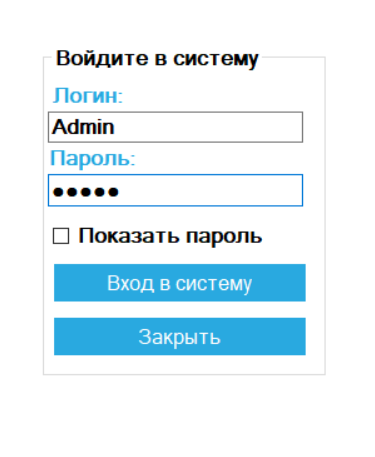
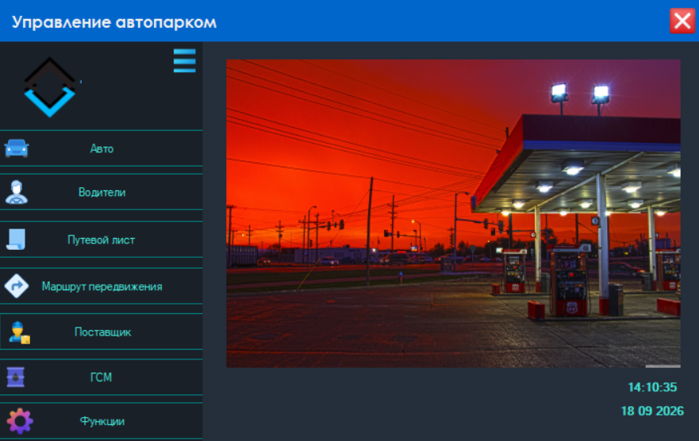
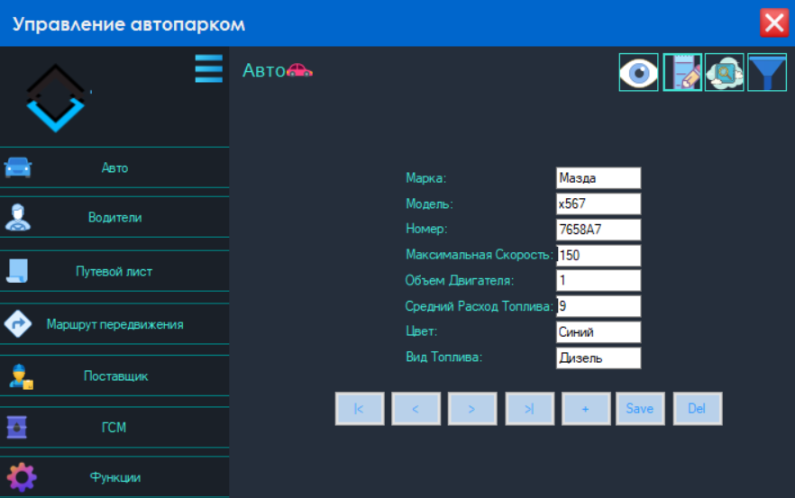
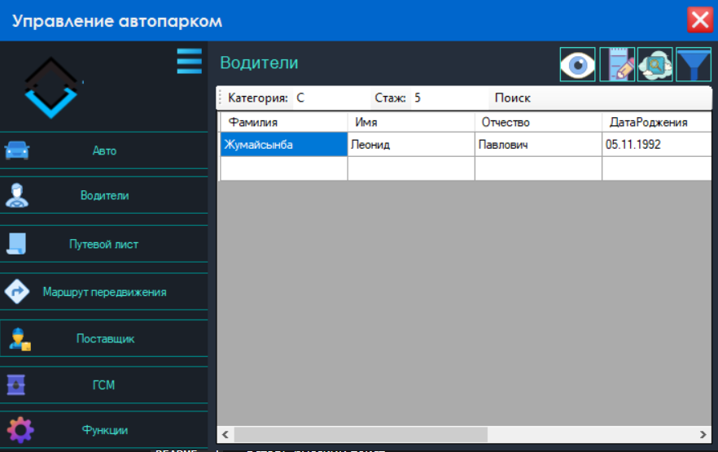
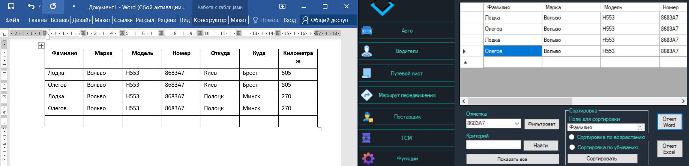
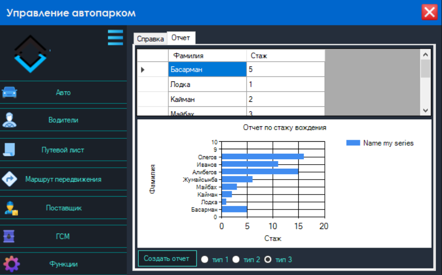

# Управление автопарком для грузовых перевозок

Десктопное приложение для автоматизации учёта автотранспорта, водителей, путевых листов, маршрутов и горюче-смазочных материалов (ГСМ) в транспортной компании.

> Стек: C#, WinForms, .NET Framework 4.8, MS SQL Server.  
> Полностью автономное приложение — работает без подключения к интернету.

## 📋 О проекте

Приложение автоматизирует полный цикл учёта автопарка грузового предприятия:

- централизованное хранение данных об автомобилях, водителях, маршрутах и ГСМ;
- добавление, редактирование, поиск и фильтрация записей;
- формирование путевых листов с экспортом в Microsoft Word;
- формирование отчётов с графиками (ReportViewer);
- экспорт табличных данных в Excel.

Все данные хранятся локально в MS SQL Server, без зависимости от облачных сервисов.

## 🖼 Скриншоты

| Форма авторизации | Главное меню |
|---|---|
|  |  |

| Форма «Авто» (редактирование) | Форма «Водители» (поиск) |
|---|---|
|  |  |

| Путевой лист + экспорт в Word | Отчёт со графиком |
|---|---|
|  |  |

## 🛠 Стек технологий

| Компонент | Технология |
|-----------|------------|
| Язык | C# |
| Платформа | .NET Framework 4.8 |
| UI | Windows Forms (WinForms) |
| СУБД | Microsoft SQL Server (LocalDB) |
| Доступ к данным | ADO.NET (DataSet + TableAdapter) |
| Отчёты | Microsoft ReportViewer |
| Экспорт в Excel | EPPlus (ExcelPackage) |
| Экспорт в Word | Microsoft.Office.Interop.Word |
| IDE | Visual Studio 2017 / 2019 / 2022 |

## ✨ Функционал

- 🔐 **Авторизация** — вход в систему по логину и паролю
- 🚚 **Авто** — добавление, редактирование, удаление автомобилей; поиск по марке и объёму двигателя; фильтрация и сортировка
- 👤 **Водители** — учёт ФИО, даты рождения, пола, категории, стажа, привязка к авто; поиск по категории и стажу
- 📄 **Путевой лист** — создание, выбор маршрута и автомобиля; экспорт в Microsoft Word
- 🗺 **Маршрут передвижения** — откуда, куда, километраж, время года, тип местности
- 🏢 **Поставщик ГСМ** — наименование организации, расчётный счёт, адрес
- ⛽ **ГСМ** — учёт видов топлива и количества литров
- 📥 **Поставка ГСМ** — операции прихода топлива
- 📤 **Выдача ГСМ** — операции выдачи топлива по путевым листам
- 📊 **Отчёты** — отчёт по стажу вождения водителей с графиком (ReportViewer)
- 📑 **Экспорт** — путевые листы в Word, таблицы в Excel

## 🚀 Быстрый старт

### Требования

- Windows 10 / 11
- Visual Studio 2019 или 2022 с workload **«.NET desktop development»**
- SQL Server Express LocalDB (устанавливается вместе с Visual Studio)
- Microsoft Office Word (для экспорта путевых листов)
- .NET Framework 4.8

### Шаги запуска

1. **Клонировать репозиторий:**
   ```bash
   git clone https://github.com/AndreyB01/Fuel-project-accounting.git
   cd Fuel-project-accounting
   ```

2. **Открыть решение:**
   Двойной клик по `Fuel-project-accounting.sln` — откроется в Visual Studio.

3. **Создать базу данных:**
   В SQL Server Object Explorer (или через SQL Server Management Studio) выполнить SQL-скрипт, создающий БД `Грузоперевозки`: таблицы, представления, хранимые процедуры и тестовые данные.
   Скрипт находится в разделе «Приложение А» пояснительной документации проекта.

4. **Проверить строку подключения** в `Fuel-project-accounting/App.config`:
   ```xml
   <connectionStrings>
       <add name="Fuel_project_accounting.Properties.Settings.ГрузоперевозкиConnectionString"
            connectionString="Data Source=(localdb)\MSSQLLocalDB;Initial Catalog=Грузоперевозки;Integrated Security=True"
            providerName="System.Data.SqlClient" />
   </connectionStrings>
   ```
   Если ваша БД развёрнута на другом сервере — замените `Data Source` и `Initial Catalog`.

5. **Запустить приложение** (F5 или Ctrl+F5).

### Учётные данные для входа

```
Логин:  Admin
Пароль: 23666
```

## 📁 Структура проекта

```
Fuel-project-accounting/
├── Fuel-project-accounting/
│   ├── Car/                  # Формы раздела «Авто»
│   ├── Driver/               # Формы раздела «Водители»
│   ├── GSM/                  # Формы раздела «ГСМ»
│   ├── Marsrut/              # Формы раздела «Маршрут передвижения»
│   ├── Postavchik/           # Формы раздела «Поставщик ГСМ»
│   ├── PostavkaGSM/          # Формы раздела «Поставка ГСМ»
│   ├── VidachaGSM/           # Формы раздела «Выдача ГСМ»
│   ├── PutList/              # Формы раздела «Путевой лист» + экспорт
│   ├── Functions/            # Раздел «Функции» (отчёты)
│   ├── Resources/            # Иконки и ресурсы
│   ├── SqlServerTypes/       # Microsoft.SqlServer.Types (redistributable)
│   ├── Form1.cs              # Форма авторизации
│   ├── MainMenu.cs           # Главное меню
│   ├── FormMenu.cs           # Контейнер форм
│   └── Program.cs            # Точка входа
├── Fuel-project-accounting.sln
├── App.config
├── docs/
│   └── screenshots/          # Скриншоты интерфейса
└── README.md
```

## 🗄 Структура базы данных

БД `Грузоперевозки` содержит 9 таблиц:

| Таблица | Назначение |
|---|---|
| `Авто` | Автомобили (марка, модель, номер, расход топлива, спидометр) |
| `Водители` | Водители (ФИО, дата рождения, категория, стаж) |
| `ПутевойЛист` | Путевые листы |
| `МаршрутПередвижения` | Маршруты (откуда, куда, километраж, время года) |
| `ГСМ` | Виды топлива и количество |
| `ВидыГСМ` | Справочник видов топлива |
| `ПоставщикГСМ` | Поставщики топлива |
| `ПоставкаГСМ` | Операции прихода топлива |
| `ВыдачаГСМ` | Операции выдачи топлива |

Дополнительно: представления (`ПросмотрАвто`, `ПросмотрВодители`, `ПросмотрПутевойЛист` и др.) и хранимые процедуры поиска.

## 📌 Ограничения

- Приложение работает **локально** — без веб-доступа и без синхронизации между устройствами.
- Экспорт в Word требует установленного Microsoft Office.
- Строка подключения настроена на LocalDB — для сетевого развёртывания требуется заменить её в `App.config`.

## 📄 Лицензия

MIT